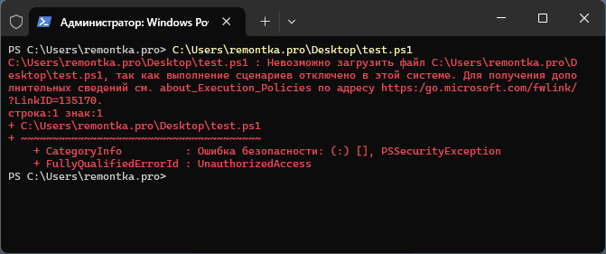

# Создание Telegram бота на Python с aiogram и pydantic_settings

## Содержание
- [Введение](#введение)
- [Установка необходимых библиотек](#установка-необходимых-библиотек)
- [Создание структуры проекта](#создание-структуры-проекта)
- [Настройка конфигурации с pydantic_settings](#настройка-конфигурации-с-pydantic_settings)
- [Создание простого Telegram бота](#создание-простого-telegram-бота)
- [Запуск бота](#запуск-бота)
- [Дальнейшее развитие](#дальнейшее-развитие)

## Введение

Данное руководство поможет вам создать Telegram бота с использованием современных Python библиотек:
- **aiogram** - асинхронный фреймворк для Telegram Bot API 
- **pydantic_settings** - библиотека для управления настройками приложения 

Преимущества этого стека:
- Полная асинхронность 
- Строгая типизация 
- Безопасное хранение конфиденциальных данных 
- Простота расширения функциональности

## Установка необходимых библиотек

### 0. Необходимо создать виртуальное окружение и запустить его

Создать виртуальное окружение
```bash
python -m venv .venv
```

Для запуска виртуального окружения, необходимо запустить скрипт, который находится по пути
```
.\.venv\Scripts\Activate.ps1
```
Если возникает **ошибка** (или ее подобие)

то необходимо сделать следующее:

- Запустить powershell от имени администратора
- Ввести команду ```Set-ExecutionPolicy Unrestricted```

### 1. Установка aiogram
```bash
pip install aiogram
```

### 2. Установка pydantic_settings
```bash
pip install pydantic-settings
```

## Создание структуры проекта

Рекомендуемая структура проекта:
```
my_telegram_bot/
├── .env
├── .gitignore
├── config.py
├── bot.py
└── requirements.txt
```

## Настройка конфигурации с pydantic_settings

### Создание файла конфигурации (`config.py`)

```python
from pydantic_settings import BaseSettings, SettingsConfigDict
from pydantic import SecretStr


class Settings(BaseSettings):
    """
    Класс для управления настройками приложения.
    Наследуется от BaseSettings для поддержки загрузки из переменных окружения.
    """
    bot_token: SecretStr # Здесь будет храниться токен бота
    model_config = SettingsConfigDict(
        env_file=".env",
        env_file_encoding="utf-8"
    )

# Создаем наш класс настроек в переменную config
config = Settings()
```

### Создание .env файла

Создайте файл `.env` в корне проекта:
```env
BOT_TOKEN=your_bot_token_here
```

**Важно:** 
- Токен бота можно получить у [@BotFather](https://t.me/BotFather) в Telegram
- Ваш user_id можно узнать у [@userinfobot](https://t.me/userinfobot)

## Создание простого Telegram бота

### Основной код бота (`bot.py`)

```python
import asyncio
import logging

from aiogram import Bot, Dispatcher, types
from aiogram.filters import Command

from config import settings

# Настройка логирования
logging.basicConfig(
    level=logging.INFO,
    format="%(asctime)s - %(name)s - %(levelname)s - %(message)s",
)
logger = logging.getLogger(__name__)

# Инициализация бота и диспетчера
bot = Bot(token=settings.BOT_TOKEN)
dp = Dispatcher()

# Обработчик команды /start
@dp.message(Command("start"))
async def cmd_start(message: types.Message):
    user_name = message.from_user.full_name
    user_id = message.from_user.id
    
    welcome_text = f"""
Привет, {user_name}! 👋

Я простой бот, созданный с помощью:
• aiogram - для работы с Telegram API
• pydantic_settings - для управления конфигурацией

Твой ID: {user_id}
Бот работает
    """
    
    await message.answer(welcome_text)


# Функция для запуска бота
async def main():
    logger.info("Запуск бота...")
    
    # Проверка доступности бота
    bot_info = await bot.get_me()
    logger.info(f"Бот @{bot_info.username} успешно запущен!")
    
    # Запуск поллинга
    await dp.start_polling(bot)

if __name__ == "__main__":
    asyncio.run(main())
```

## Запуск бота

### 1. Еще раз проверить, что у вас активирован venv

В терминале увидите `(.venv)` в начале строки приглашения ввода
```bash
python -m venv venv
source venv/bin/activate  # Linux/MacOS
.\.venv\Scripts\activate     # Windows
```

### 2. Запуск бота
```bash
python bot.py
```

### 3. Проверка работы
Откройте Telegram и найдите своего бота по username. Отправьте команды:
- `/start` - приветственное сообщение
- Любое другое сообщение - ничего не ответит

## Заключение

Вы создали базового Telegram бота с использованием современных инструментов. Основные преимущества этого подхода:

- ✅ **Безопасность**: Токен защищен через .env файл 
- ✅ **Типизация**: Полная поддержка type hints 
- ✅ **Асинхронность**: Высокая производительность 
- ✅ **Масштабируемость**: Легко добавлять новый функционал
- ✅ **Поддержка**: Активное сообщество и документация

Для дальнейшего изучения обратитесь к официальной документации:
- [aiogram documentation](https://docs.aiogram.dev/)
- [pydantic settings documentation](https://docs.pydantic.dev/latest/concepts/pydantic_settings/)